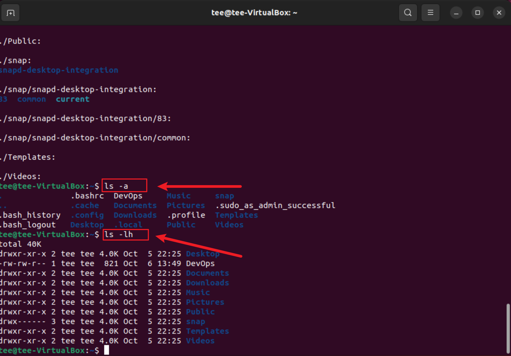

# Linux Implementation

In this project, I will be implementing some basic Linux commmands

## 1. sudo command

The *`sudo`* command temporarily elevates privileges allowing users to complete sensitive tasks without logging in as the root user.

To use this, we use the syntax `sudo apt upgrade`. 

See illustration below:

## 2. pwd command

The *`pwd`* stands for Print Working Directory. It prints the path of the working directory, starting from the root.

Syntax for this is `pwd`. 

See illustration below:

## 3. cd command

*`cd`* command in Linux known as the change directory command. It is used to move efficiently from the current working directory to different directories in our System.

Syntax for this command is `cd`. 

See illustration below:

## 4. ls command

*`ls`* is a Linux shell command that lists directory contents of files and directories.  It provides valuable information about files, directories, and their attributes.

Syntax for this is `ls [option]`. 

See illustration below:

## 5. cat command

*`cat`* (concatenate) command reads data from the file and gives its content as output. It helps us to create, view, and concatenate files. 

Syntax for this is `cat`. 

See illustration below:

## 6. cp command

*`cp`* stands for a copy. This command is used to copy files or groups of files or directories. It creates an exact image of a file on a disk with a different file name. cp command requires at least two filenames in its arguments. 

Syntax for this is `cp`. 

See illustration below:

## 7. mv command

*`mv`* command is used to rename file directories and move files from one location to another within a file system. 

Syntax for this is `mv`. 

See illustration below:

## 8. mkdir command

*`mkdir`* command in Linux allows the user to create directories. This command can create multiple directories at once as well as set the permissions for the directories. 

Syntax for this is `mkdir [option]`. 

See illustration below:

## 9. rmdir command

*`rmidr`* command is useful when you want to remove the empty directories from the filesystem in Linux.

Syntax for this is `rmdir [option]`. 

See illustration below:

## 10. rm command

*`rm`* stands for remove here. rm command is used to remove objects such as files, directories, symbolic links and so on from the file system.

Syntax for this is `rm filename`. 

See illustration below:

## 11. touch Command

*`touch`* command is a way to create empty files. You can update the modification and access time of each file with the help of touch command.

Syntax for this is `touch filename`. 

See illustration below: 

## 12. locate Command

*`locate`* locate command in Linux is used to find the files by name.

Syntax for this is `locate filename`. 

See illustration below: 

## 13. find Command

The *`find`* command can be used to find files and directories and perform subsequent operations on them. It supports searching by file, folder, name, creation date, modification date, owner and permissions.

Syntax for this is `find [options] [path] [expression]`. 

See illustration below: 

## 14. grep Command

The *`grep`* filter searches a file for a particular pattern of characters, and displays all lines that contain that pattern.

Syntax for this is `grep [options] [filename]`. 

See illustration below:

## 15. df command

disk free also known as *`df`* provides valuable information on disk space utilization. The df command displays information about file system disk space usage on the mounted file system. 

Syntax for this is `df [options] [file]`. 

See illustration below:

## 16. du command

*`du`* command is used for estimating file and directory space usage. The name `du` stands for “disk usage”. It provides information about the storage consumption of files and directories.

Syntax for this is `du [options] [directory/file]`. 

See illustration below:

## 17. head command

The *`head`* command, as the name implies, print the top N number of data of the given input. By default, it prints the first 10 lines of the specified files. If more than one file name is provided then data from each file is preceded by its file name. 

Syntax for this is `head [options] [file]`. 

See illustration below:

## 18. tail command

The `tail` command, as the name implies, print the last N number of data of the given input. By default it prints the last 10 lines of the specified files. If more than one file name is provided then data from each file is precedes by its file name.

Syntax for this is `tail [options] [file]`. 

See illustration below:

## 19. diff command

*`diff`* stands for difference. This command is used to display the differences in the files by comparing the files line by line, it tells us which lines in one file have is to be changed to make the two files identical.

Syntax for this is `diff [options] [filename]`. 

See illustration below:

## 20 tar command

The *`tar`* stands for tape archive, which is used to create Archive and extract the Archive files. We can use the Linux *`tar`* command to create compressed or uncompressed Archive files and also maintain and modify them. 

Syntax for this is `tar [options] [archive-file] [file or directory to be archived]`. 

See illustration below:

## 21. chmod command

The *`chmod`* command is used to modify this permission so that it can grant or restrict access to directories and files.

Syntax for this is `chmod [options] [mode] [File_name]`. 

See illustration below:

## 22. chown command

*`chown`* command is used to change the file Owner or group.

Syntax for this is `chown [OPTION][OWNER][:GROUP] FILE`. 

See illustration below:

## 23. jobs command '

*`jobs`* command is used to list the jobs that you are running in the background and in the foreground. If the prompt is returned with no information no jobs are present.

Syntax for this is `jobs [options] jodID`. 

See illustration below:

## 24. kill command

*`kill`* command in Linux is a built-in command which is used to terminate processes manually. *`kill`* command sends a signal to a process that terminates the process. If the user doesn’t specify any signal which is to be sent along with the *`kill`* command, then a default TERM signal is sent that terminates the process.

Syntax for this is `kill [signal] PID
`. 

See illustration below:

## 25. PING command

*`ping`* (Packet Internet Groper) command is used to check the network connectivity between host and server/host. This command takes as input the IP address or the URL and sends a data packet to the specified address with the message “PING” and get a response from the server/host this time is recorded which is called latency.

Syntax for this is `ping [option] [hostname or IP address]
`. 

See illustration below:

## 26. Wget command

`Wget` is the non-interactive network downloader which is used to download files from the server even when the user has not logged on to the system and it can work in the background without hindering the current process. 

Syntax for this is `wget [option] [URL]
`. 

See illustration below:

## 27. uname command

The command *`uname`* displays the information about the system.

Syntax for this is `uname [OPTION]
`. See illustration below:

## 28. top command

`top` command is used to show the Linux processes. It provides a dynamic real-time view of the running system.

Syntax for this is `top`. 

See illustration below:

## 29. history command

*`history`* command is used to view the previously executed command.

Syntax for this is `history [OPTION]
`. 

See illustration below:

## 30. man command

man command in Linux is used to display the user manual of any command that we can run on the terminal.

Syntax for this is `man [command_name]
`. 

See illustration below:

## 31. echo command

The `echo` command in Linux is a built-in command that allows users to display lines of text or strings that are passed as arguments. It is commonly used in shell scripts and batch files to output status text to the screen or a file.

Syntax for this is `echo [option] [string]
`. 

See illustration below:

## zip command

`zip` is used to compress files to reduce file size and is also used as a file package utility.
The `zip` program puts one or more compressed files into a single zip archive, along with information about the files (name, path, date, time of last modification, protection, and check information to verify file integrity).

Syntax for this is `zip [options] [file_name.zip] [files_names]`. 

See illustration below:

## 33. hostname command

*`hostname`* command in Linux is used to obtain the DNS (Domain Name System) name and set the system's hostname or NIS (Network Information System) domain name.

Syntax for this is `hostname [option]
`. 

See illustration below:

## 34. useradd, userdel command

*`useradd`* is a command in Linux that is used to add user accounts to your system

*`userdel`* command in Linux system is used to delete a user account and related files.

Syntax for this is `useradd [options] [User_name]`, `userdel [options] LOGIN`. 

See illustration below:

## 35. apt-get

*`apt-get`* is a command-line tool that helps in handling packages in Linux. Its main task is to retrieve the information and packages from the authenticated sources for installation, upgrade, and removal of packages along with their dependencies.

Syntax for this is `apt-get [options] (command)`. 

See illustration below:

## 36. Nano, Vi, Jed Commands

Linux lets users edit files using a text editor like *`nano`*, *`vi`*, or *`jed`*. While most distributions include nano and vi, users must install jed manually.

Syntax for this is `nano [filename], vi [filename], jed [filename]`. 

See illustration below:

## 37. alias_unalias commands

*`alias`* command instructs the shell to replace one string with another string while executing the commands. *`unalias`* command deletes it.

Syntax for this is `alias name="value", unalias [alias name]`. 

See illustration below:

## 38 su command

`su` command is an abbreviation for “substitute user” because it is used for switching to another user during a normal login session.

Syntax for this is `su [options] [usersname [arguments]]`. 

See illustration below:

## 39. htop command

The *`htop`* command is like a newer and better version of the top command. It allows us to scroll vertically and horizontally, to view all the processes running on the system.

Syntax for this is `htop [options]`. 

See illustration below:

## 40. ps comand

*`ps`* command is used to list the currently running processes and their PIDs along with some other information depends on different options.

Syntax for this is `ps [options]`. 

See illustration below: 

