# Git Project

## Basic Git Project Implementation

### 01. Initializing a Git Repository

#### - Here, we create a working folder or directory

#### - Move into our working folder

#### - Then run command *`git` `init`*

See illustration below: 

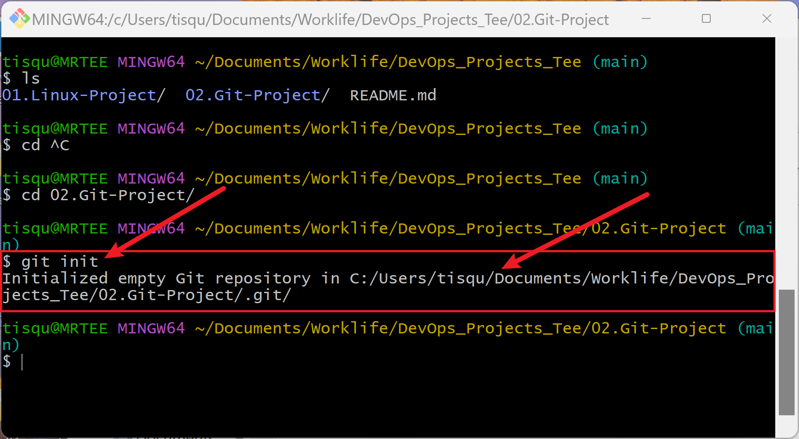

### 02. Git commit

#### - To do this, in our working directory we created a file *`touch` `index.txt`*

#### - Wrote a sentence in that file, saved our changes,

#### - Added our change to git staging using command *`git` `add`*

#### - We then committed to git using command *`git` `commit`* *`-m` `"Project 2-Git"`*

See illustration below: 

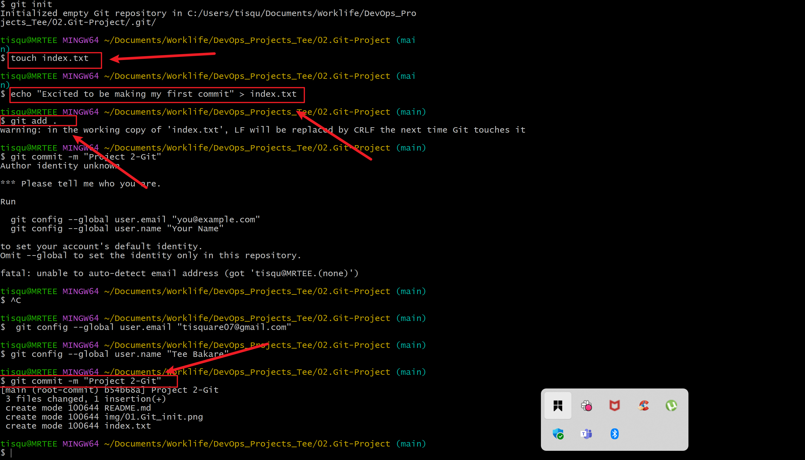

## Working with Branches

In Git, a branch is a new/separate version of the main repository. 

### 03. Making a new Branch

#### - We use *`git` `checkout`* *`-b`* in creating a new branch

#### - The *`-b`* helps us create or change into the new branch

See illustration below: 

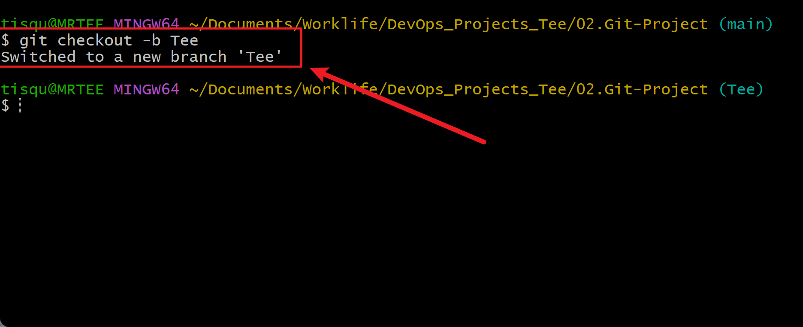

### 04. Listing Git Branches 

We use this command to list branches.

#### - This can be achieved with command *`git` `branch`*

See illustration below: 

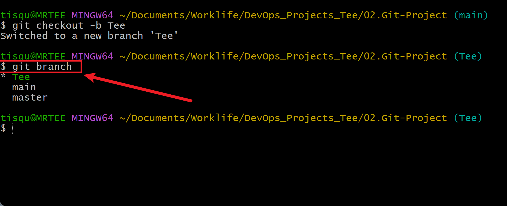

### 05. Changing into an Old Branch

#### - To change into an existing branch,

#### - We use the command *`git` `checkout`* *`<branch-name>`*

See illustration below: 

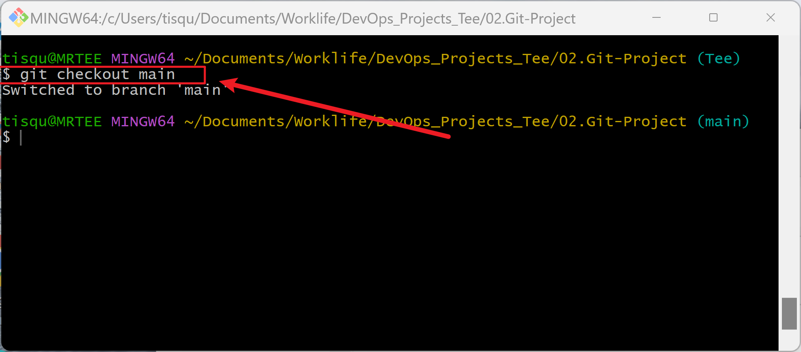

### 06. Merging a Branch to Another Branch

To merge branches locally, use git checkout to switch to the branch you want to merge into. This branch is typically the main branch. Next, use git merge and specify the name of the other branch to bring into this branch

#### - First we change into our main branch

#### - Then run git command *`git` `merge`* *`<branch-name>`*

See illustration below: 

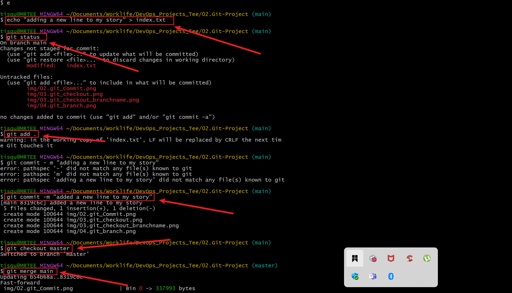

### 07. Deleting a Git Branch

#### - The command to delete a local git branch can take one of the following two forms: *`git`* *`branch`* *`--delete`* *`<old-branch>`*, *`git`* *`branch`* *`-d`* *`<old-branch>`*

See illustration below:

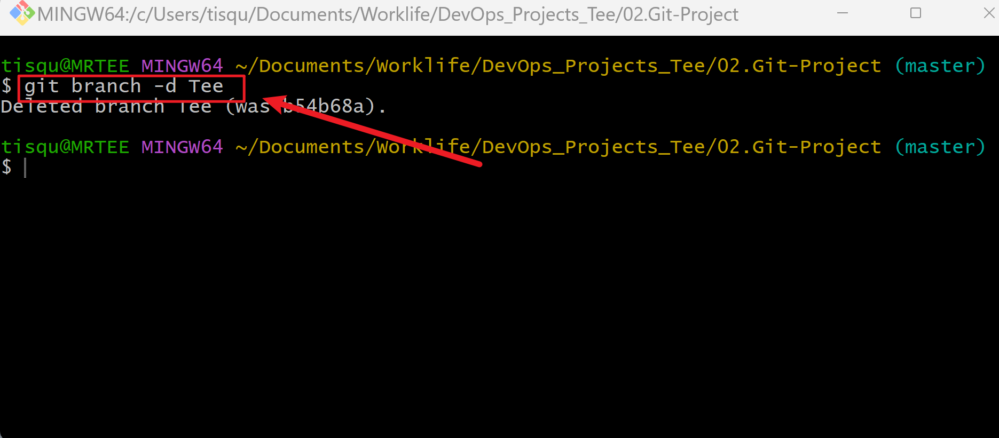

## Collaboration and Remote Repository

### 08. Create a New Reporository

#### - Here, first we created a github account at *`(https://github.com/join)`*

#### - After completion of account creation we created a new repository

See below:

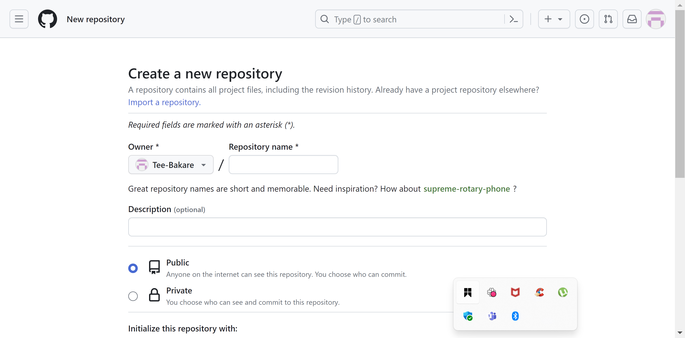

### 09. Git add origin

#### - Copying the code from the newly created repository, we pasted on `git` `bash`

See illustration below:

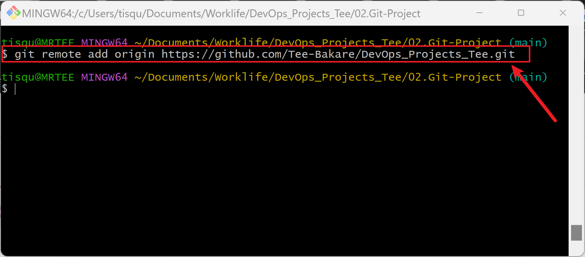

### 10. Push origin

#### - After committing changes to local repo, we pushed content to remote repo.

See illustration below:

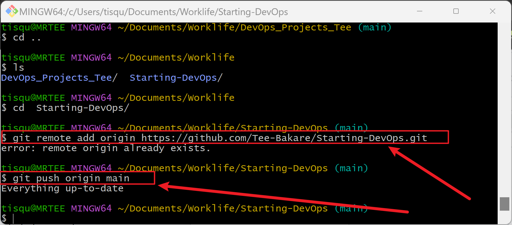

### 11. Cloning Remote Git Repository

See illustration below:

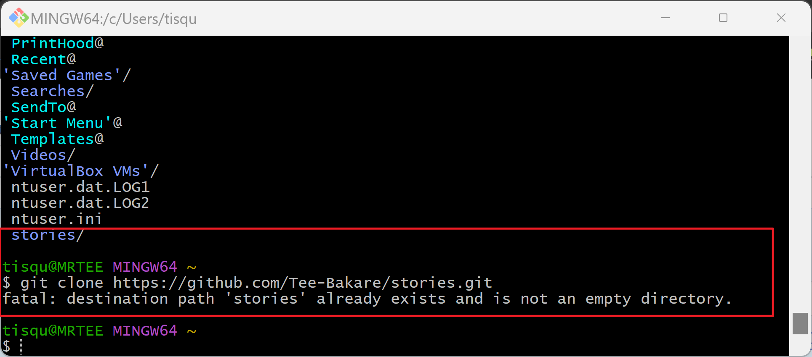

## Branch Management and Tagging

### Introduction to Markdown Syntax

### 12. Headings

To create headings, we use the hash(#) button symbol at the beginning of the line. 

#### - The number of hash(#) symbol used indicates the level of the heading

See example below:

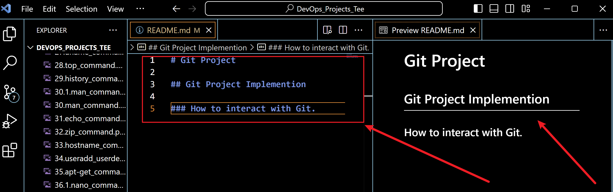

### 13. Emphasis

#### - Asterisks or Underscore is used here 

See example below:

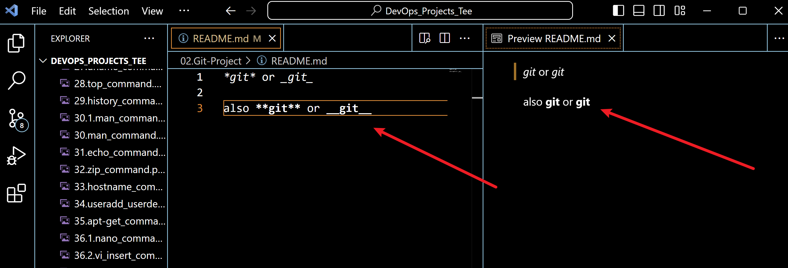

### 14. Lists

#### - Markdown has support for both ordered and unordered type of list

See examples below:

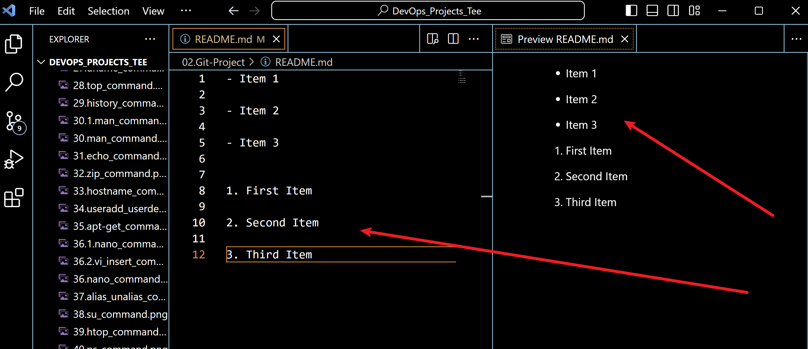

### 15. Links

#### - To create hyperlink, use square-brackets "[]" for the link, followed by parentheses containing the URL.

See examples below:

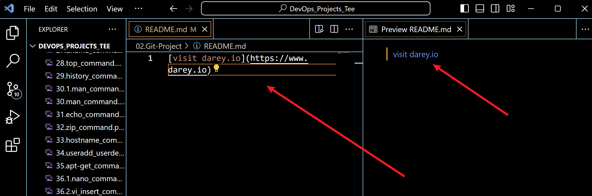

### 16. Images

#### -  To display images, we use an exclamation mark "!", followed by square-brackets "[]" for the alt text and parentheses containing the URL.

See example below:

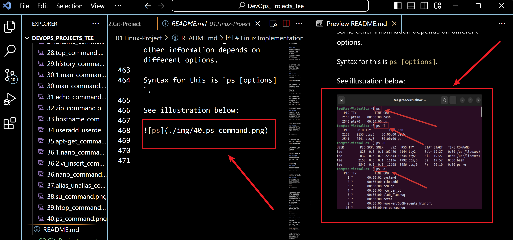

### 17. Code

#### - To display code or code snippets, use backticks (`) to enclose the code.

See example below:

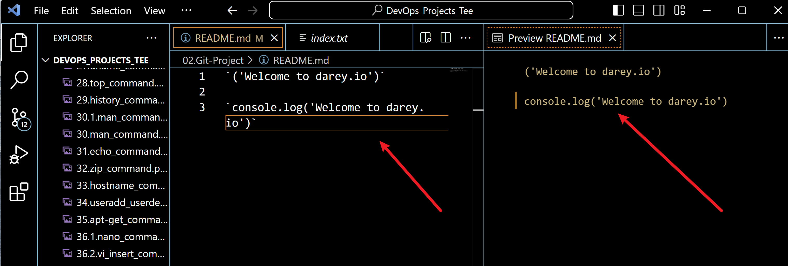