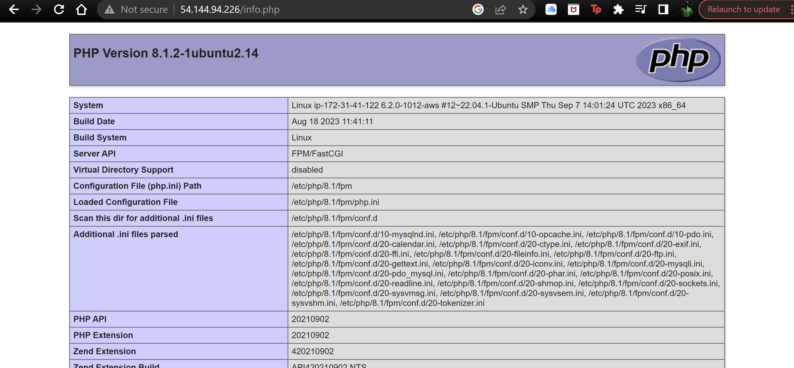

# LEMP PROJECT

## Web Stack Implementation (Lemp Stack)

LEMP is an open-source web application stack used to develop web applications. The term LEMP is an acronym that represents L for the Linux Operating system, Nginx (pronounced as engine-x, hence the E in the acronym) web server, M for MySQL database, and P for PHP scripting language.

LEMP Stands For:

L- Linux Operating System
E- Nginx Server
M- MySQL Database
P- PHP
LEMP enjoys good community support and is used around the world in many highly-scaled web applications. Nginx is the second most widely used web server in the world following Apache.

### Step 0 - Preparing Prerequisites

Linking ASW Ec2 instance to git bash

Using command: *`ssh`* *`-i`* *`<private-key.pem> ubuntu@<EC2-Public-IP-address>`*

### Step 1 - Installing Nginx Web Server

#### System Status

To verify nginx was successfully installed we run: *`systemctl`* *`status`* *`nginx`*

#### Accessing locally from Ubuntu shell

- Using command: *`curl`* *`http://localhost:80`*
or *`curl`* *`http://127.0.0.1:80`*

- Also checking from URL portal

### Step 2 - Installing MySQL

What is MySQL used for?
MySQL is a relational database management system based on SQL – Structured Query Language. The application is used for a wide range of purposes, including data warehousing, e-commerce, and logging applications. The most common use for mySQL however, is for the purpose of a web database.

#### Installing MySQL

- Using command: $ *`sudo`* *`apt`* *`install`* *`mysql-server`*

- It is also recommended to run a security script that comes pre-installed. This script removes some insecure default settings and lock down access to database.

- We do this with the code: *`ALTER`* *`USER`* *`'root'@'localhost'`* *`IDENTIFIED`* *`WITH`* *`mysql_native_password`* *`BY`* *`'PassWord.1';`*

- After this, test by logging to MySQL console by typing: *`mysql`* *`-p`*

### Step 3 - Installing PHP

PHP is an open-source, server-side programming language that can be used to create websites, applications, customer relationship management systems and more. It is a widely-used general-purpose language that can be embedded into HTML. This functionality with HTML means that the PHP language has remained popular with developers as it helps to simplify HTML code.

#### Installing PHP

- First, we install 2 packages using command: *`sudo`* *`apt`* *`install`* *`php-fpm`* *`php-mysql`*

### Step 4 - Configuring Nginx to Use PHP Processor

#### Creating root web directory for domain:

- Making a directory using command: *`sudo`* `*mkdir`* *`/var/www/projectLEMP`*

- Assigning ownership of directory with $USER environment variable using command: *`sudo`* *`chown`* *`-R`* *`$USER:$USER`* *`/var/www/projectLEMP`*

- Opening a new configuration file in Nginx using command-line editor: *`sudo`* *`nano`* *`/etc/nginx/sites-available/projectLEMP`*

- Activate configuration by linking to the config file from Nginx's directory using command: *`sudo`* *`ln`* *`-s`* *`/etc/nginx/sites-available/projectLEMP`* *`/etc/nginx/sites-enabled/`*
 

- Testing Configuration using command:  `sudo` `nginx -t `

- Also to disable default Nginx host that is currently configured to listen to port 80, we use command: *`sudo`* *`unlink`* *`/etc/nginx/sites-enabled/default`*

- When ready, reload Nginx to apply changes using command: *`sudo`* *`systemctl`* *`reload`* *`nginx`*

To creat an index.html to test using the echo command: *`sudo`* *`echo`* *`'Hello`* *`LEMP`* *`from`* *`hostname'`* *`$(curl`* *`-s`* http://169.254.169.254/latest/meta-data/public-hostname) *`'with`* *`public`* *`IP'` **`$(curl`* *`-s`* http://169.254.169.254/latest/meta-data/public-ipv4) > *`/var/www/projectLEMP/index.html`*

### Step 5 - Testing PHP with Nginx

- Validating if Nginx can correctly hand *.php* files off to PHP processor by running command: `nano` `/var/www/projectLEMP/info.php`

- and inputing below lines `<?php`
`phpinfo();`

- followed by accessing page in web browser by visiting domain name using: *http://`server_domain_or_IP`/info.php*

The image below should appear on screen containing detailed information.

### Step 6 - Retrieving data from MySQL database with PHP

- First, connect to the MySQL console usuing root account with command: `mysql`

- Create a new database running the command: `CREATE` `DATABASE` `example_database`;`

- Creating a new user with full privileges on database using command: *`CREATE`* *`USER`* *`'example_user'@'%'` **`IDENTIFIED`* *`WITH`* *`mysql_native_password`* *`BY`* *`'PassWord.1';`*

- Also we give this user permission over the *`example_database`* database using command: *`GRANT`* *`ALL`* *`ON`* *`example_database.*`* *`TO`* *`'example_user'@'%';`*

- To test if new user has proper permissions, we can log in again using custom user credentials by using command: *`mysql`* *`-u`* *`example_user`* *`-p`*

- After logging in, confirm if access has been granted by running command: *`SHOW`* *`DATABASES;`*

- Next, the creation of a todo_list was made from MySQl console using command: *`CREATE`* *`TABLE`* *`example_database.todo_list`* *`(item_id`* *`INT`* *`AUTO_INCREMENT,content`* *`VARCHAR(255),PRIMARY`* *`KEY(item_id));`*

- Insert a few rows of content in test table using command: *`INSERT`* *`INTO`* *`example_database.todo_list`* *`(content)`* *`VALUES` *`*("My`* *`first`* *`important`* *`item");`*

- Now, to confirm if the data was successfully saved, run command: *`SELECT`* *`*`* *`FROM` **`example_database.todo_list;`*

- Now to create a PHP script that connects to MySQL and query for content, we run command: *`nano`* *`/var/www/projectLEMP/todo_list.php`*

- And then we input this into our todo_list.php script:

`<?php`

`$user` `=` `"example_user";`

`$password` `=` `"PassWord.1";`

`$database` `=` `"example_database";`

`$table` `=` `"todo_list";`

`try` `{`

  `$db` `=` `new` `PDO("mysql:host=localhost;dbname=$database",` `$user,` `$password);`

  `echo` `<h2>``"TODO``</h2><ol>";`</h2><ol>";
  `foreach($db->query("SELECT` `content` `FROM` `$table")` `as` `$row)` {
    
`echo` `"<li>"` `.` `$row['content']` `.` `"</li>";`

  `}`

  `echo` `"</ol>";`

`}`

`catch` `(PDOException` `$e)` `{`

    `print` "Error!: " . $e->getMessage() . " ";
    die();

  }

- Save when done editing. We can then view this on web browser using: `http://<Public_domain_or_IP>/todo_list.php`

