# Introduction to Shell Scripting and User Input

## Introduction to Shell Scripting and User Input

A shell script is a text file that contains a sequence of commands for a UNIX-based operating system. It is called a shell script because it combines a sequence of commands, that would otherwise have to be typed into the keyboard one at a time, into a single script. The shell is the operating system's command-line interface (CLI) and interpreter for the set of commands that are used to communicate with the system.

A shell script is usually created for command sequences in which a user has a need to use repeatedly in order to save time. Like other programs, the shell script can contain parameters, comments and subcommands that the shell must follow. Users initiate the sequence of commands in the shell script by simply entering the file name on a command line.

## Examples of Shell Script Applications
Using a shell script is most useful for repetitive tasks that may be time consuming to execute by typing one line at a time. A few examples of applications shell scripts can be used for include:

- Automating the code compiling process.
- Running a program or creating a program environment.
- Completing batch
- Manipulating files.
- Linking existing programs together.
- Executing routine backups.
- Monitoring a system.

## Shell Scriptng Syntax Elements With Examples

#### - Variables: Bash allows you to define and work with variables. Variable can store data of various types such as nu,bers, strings and arrays. We can assign variables using the `=` operator, and access their values using the `$`.

See Example below:

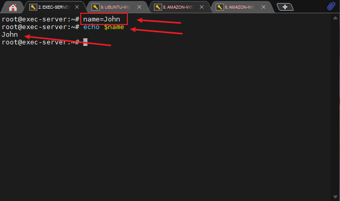

#### - Control Flow: This allows us to make decisions, iterate over lists, and execute different commands based on conditions, using statements such as: if, else, for loops.

See Example below:

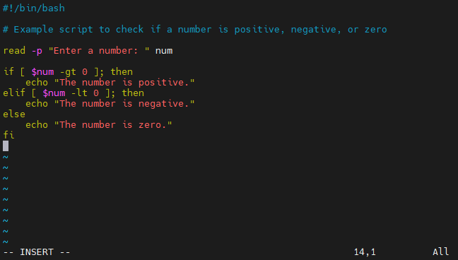

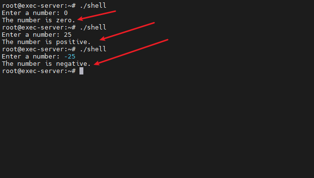

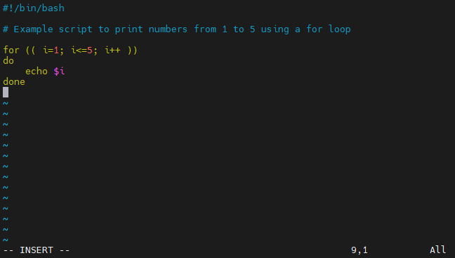

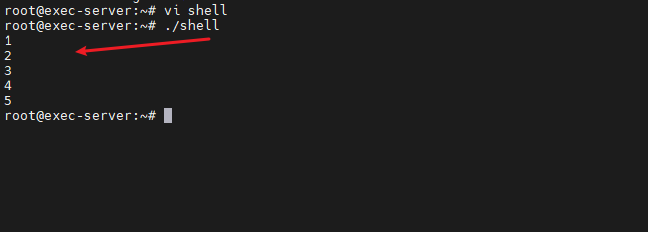

#### - Functions: Bash also allows us to define functions to group related commands together. 

See Example below:

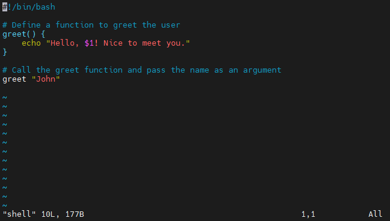

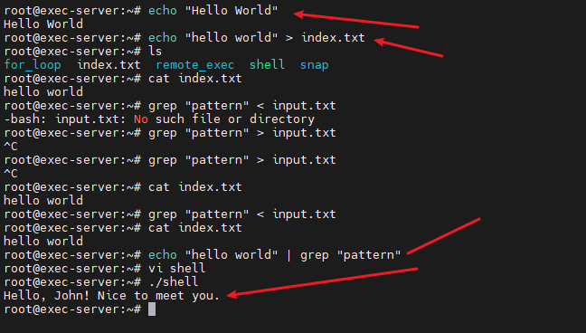

## Writing First Shell Script

#### - Step 1: Created on terminal  a folder named `"shell-scripting"`. 
#### - Step 2: Created a file `"user-input.sh"` which will hold my command.
#### - Step 3: Inside the `"user-input.sh"`, we inputed our code: 

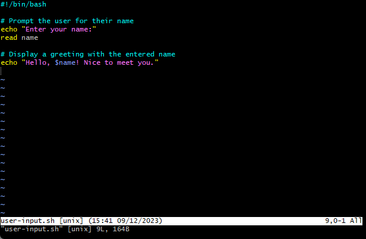

#### - Step 4: Saved it.
#### - Step 5: Run the command `sudo` `chmod` `+x` `user-input.sh` to make it executable.

#### - Step 6: Ran the command using `./user-input.sh`

See below: 

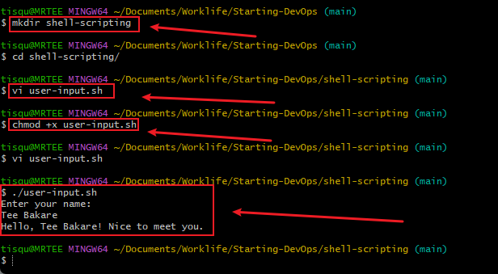

## Directory, Manipulation and Navigation

#### - Step 1: Created a file named `"navigating-linux-filesystem.sh"`

#### - Step 2: Pasted code block.
See below:

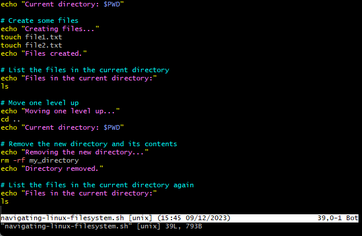

#### - Step 3: Ran the command `sudo` `chmod` `+x` `navigating-linux-filesystem.sh`

#### - Step 4: Ran the script using `./navigating-linux-filesystem.sh`

See result below:

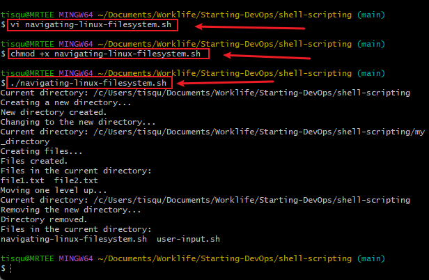

## File Operations and Sorting

#### - Step 1: Created a file named `"sorting.sh"`

#### - Step 2: Pasted code block.

See below:

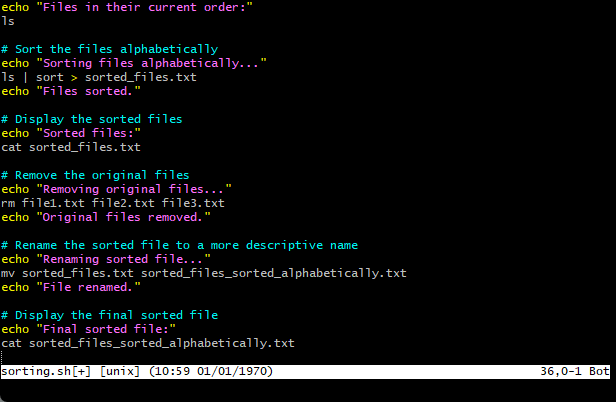

#### - Step 3: Ran the command `sudo` `chmod` `+x` `sorting.sh`

#### - Step 4: Ran the script using `./sorting.sh`

See result below:

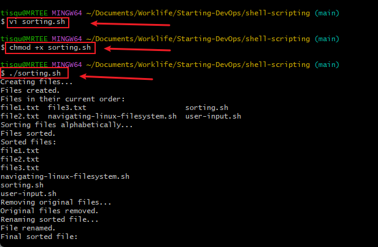

## Working with Numbers and Calculations

#### - Step 1: Created a file named `"calculations.sh"`

#### - Step 2: Pasted code block.

See below: 

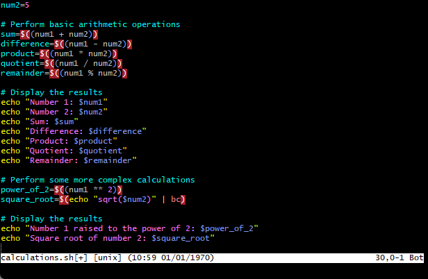

#### - Step 3: Ran the command `sudo` `hmod` `+x` `calculations.sh`

#### - Step 4: Ran the script using `./calculations.sh`

See result below:

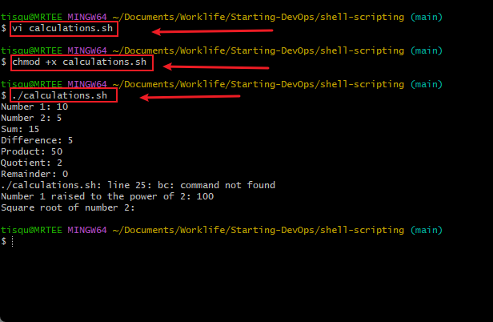

## File Backup and Timestamping

#### - Step 1: Created a file named `"backup.sh"`

#### - Step 2: Pasted code block.

See below:

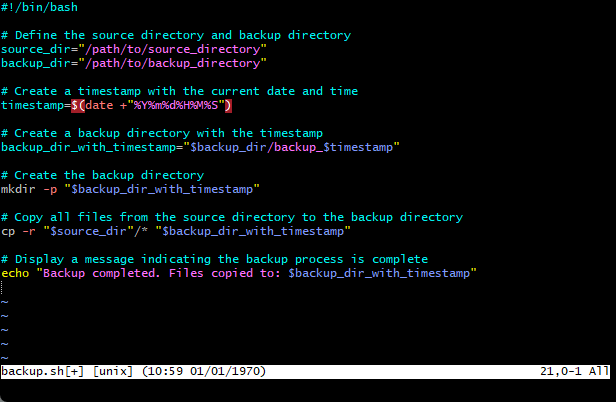

#### - Step 3: Ran the command `sudo` `hmod` `+x` `backup.sh`

#### - Step 4: Ran the script using `./backup.sh`

See result below:

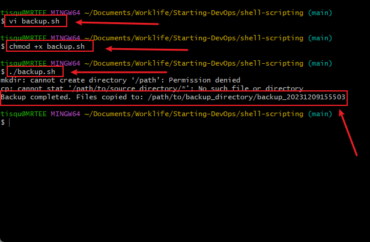

