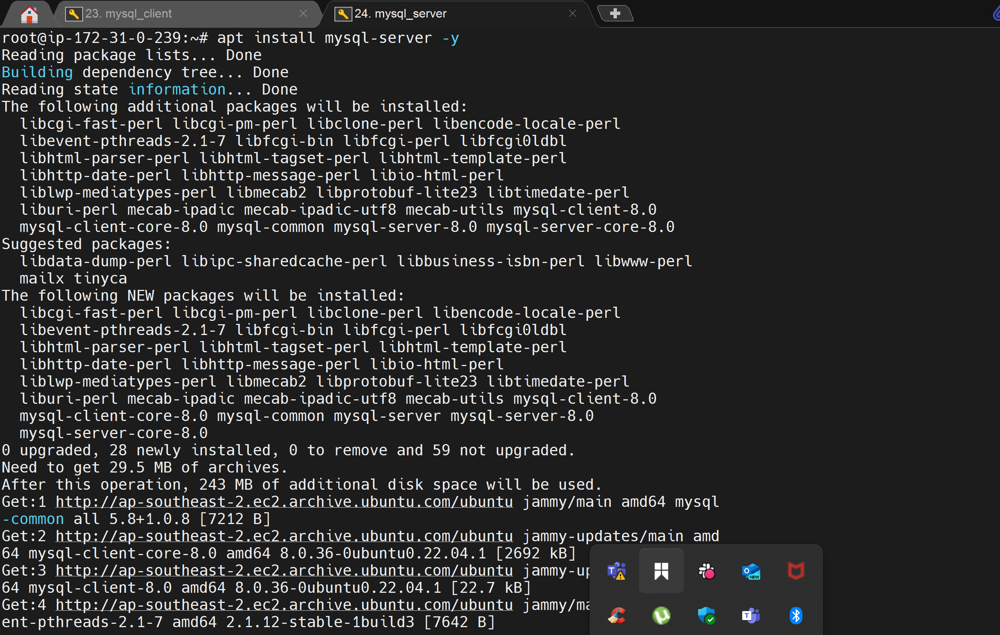
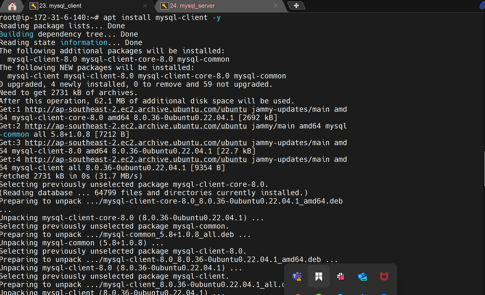
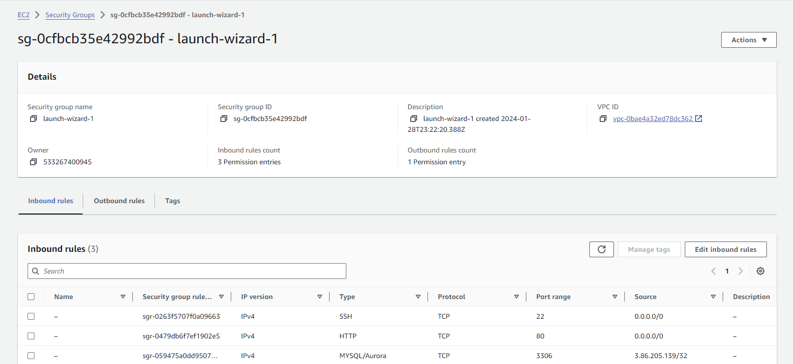
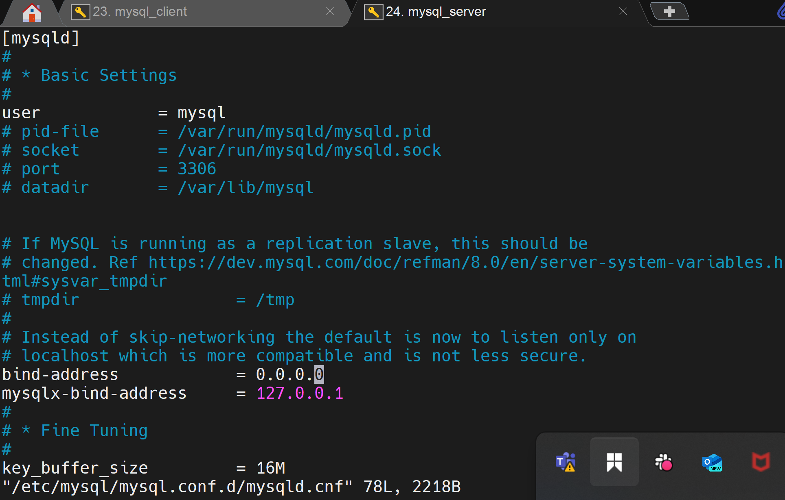
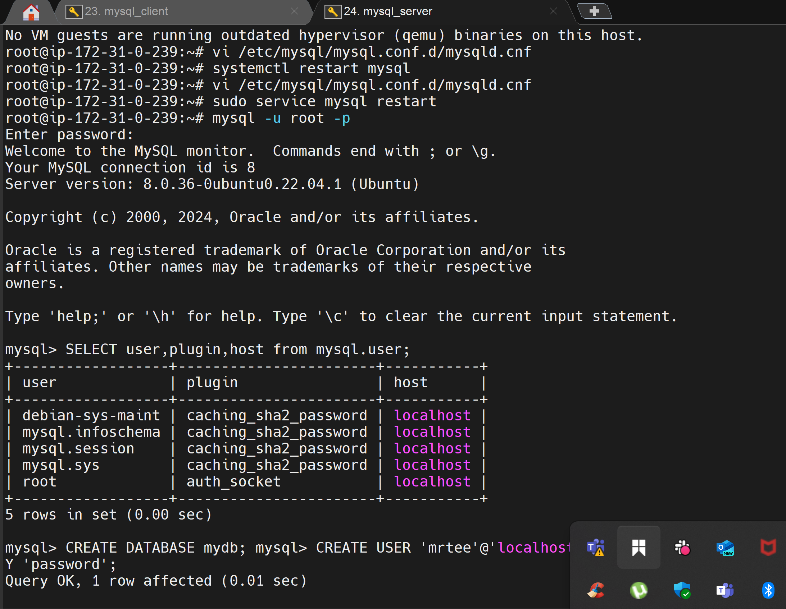
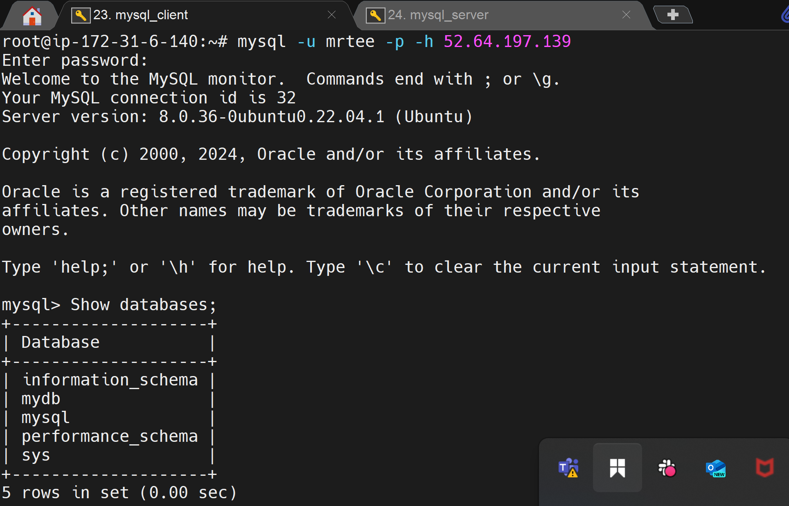

# Understanding Client-Server_Architecture _with_MYSQL

Client-Server refers to an architecture in which two or more computers are connected together over a network to send and receive requests between one another.

In their communication, each machine has its own role: the machine sending requests is usually referred as "Client" and the machine responding (serving) is called "Server".

In this case, our Web Server has a role of a "Client" that connects and reads/writes to/from a Database (DB) Server (MySQL, MongoDB, Oracle, SQL Server or any other), and the communication between them happens over a Local Network (it can also be Internet connection, but it is a common practice to place Web Server and DB Server close to each other in local network).

## Implementing a Client Server Architecture using MySQL Database Management System (DBMS).

#### - First we created  two Linux-based virtual servers (EC2 instances in AWS) with names:

- Server A name - `mysql server`
- Server B name - `mysql client`

See image:

#### - Then installed MySQL Server software on `mysql server` Linux Server install by using syntax `apt install mysql-server`, and on `mysql client`, installed `MySQL Server software`.

See image:

#### - Next, use mysql server's local IP address to connect from mysql client. MySQL server uses TCP port 3306 by default, so you will have to open it by creating a new entry in ‘Inbound rules’ in ‘mysql server’ Security Groups.

See image:  

#### - Configuring MySQL server to allow connections from remote hosts using syntax `sudo nano /etc/mysql/mysql.conf.d/mysqld.cnf`, and and replace the following line: bind-address = 127.0.0.1 with the following line: bind-address = 0.0.0.0

See image: 

#### - On mysql-server I created a new user: 

#### - To connect to the mysql server, in my mysql client I entered the following code: `mysql -u mrtee -h 52.64.197.139 -p`, to connect remotely and also `show databases;`, to show database.

See Image:

End.