# Introduction to LoadBalancing and Nginx

Load balancing refers to efficiently distributing incoming network traffic across a group of backend servers, also known as a server farm or server pool.

Nginx, a popular web server software, can be configured as a simple yet powerful load balancer to improve your server's resource availability and efficiency. Nginx acts as a single entry point to a distributed web application working on multiple separate servers.

## Setting Up a Basic Load Balancer Using Ec2

### Step 1 - Launch EC2 instances with an Ubuntu AMI and use User Data to install the Apache Web Server.

Log in to your AWS Console and go to the EC2 dashboard.

Click on the “Launch Instance” button and select “Ubuntu Server “.

Refer to image:

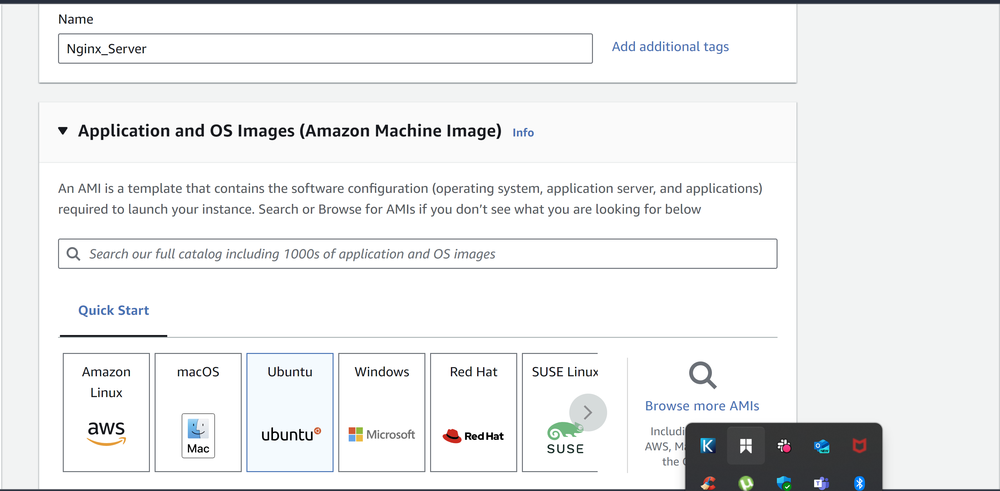

### Step 2 - Inboud Rule to Port 8000

Open port 8000. Server will run on port 8000 while load balancer will run on 80. To do this we add a rule to security group allowing traffic from anywhere. 

Refer to image:

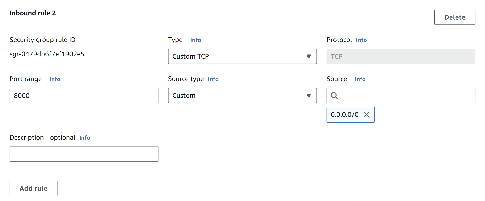

### Step 3 - Apache Webserver Installation

After opening necessary ports, we connect to webser and input command `sudo apt update -y &&  sudo apt install apache2 -y`, to install apache.

Refer to image:

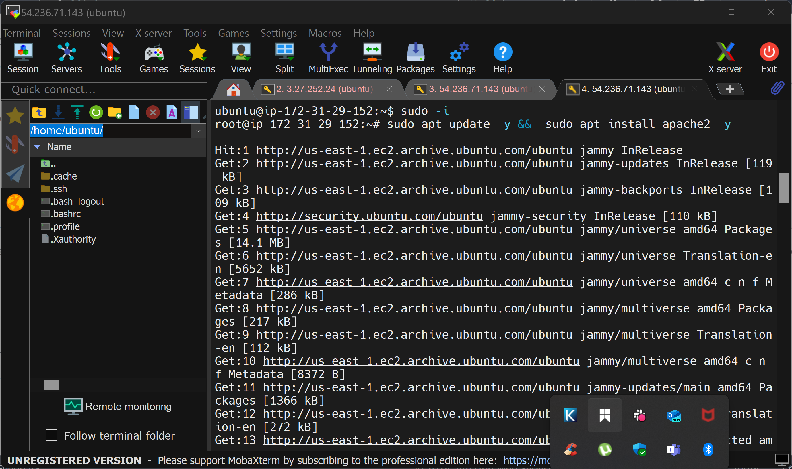

- Then verify apache is running by command `sudo systemctl status apache2`.

Refer to image:

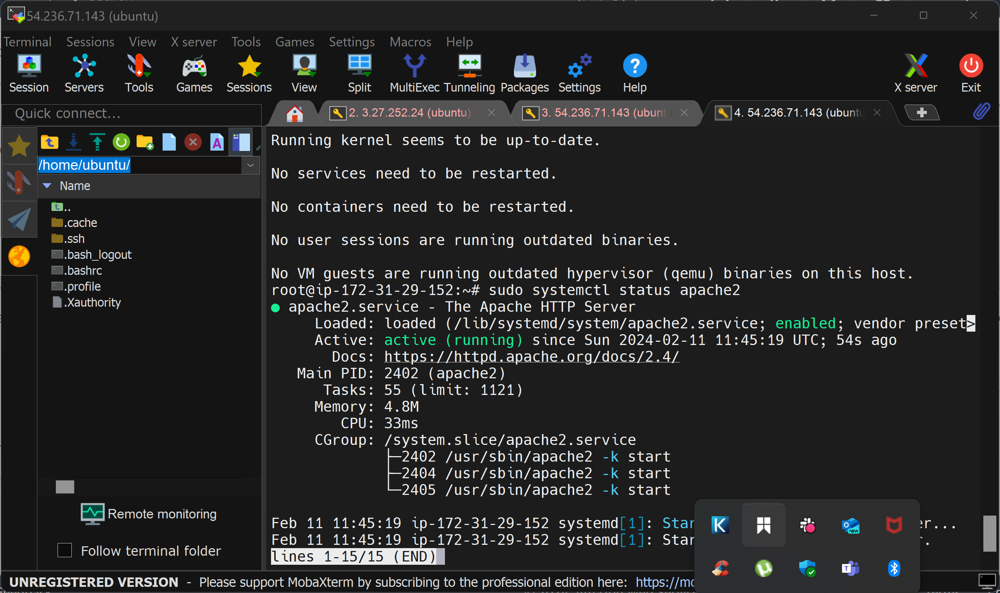

### Step 4 - Configure Apache to Server a Page Showing Public IP

We start by configuring Apache webser to serve content on port 8000. Then we create a new `index.html` file. Then override apache webserver's default html with new file.

- Using vi editor we opened file: `sudo vi /etc/apache2/ports.conf`, added a new `Listen` directive for port `8000`, then save.

Refer to image:

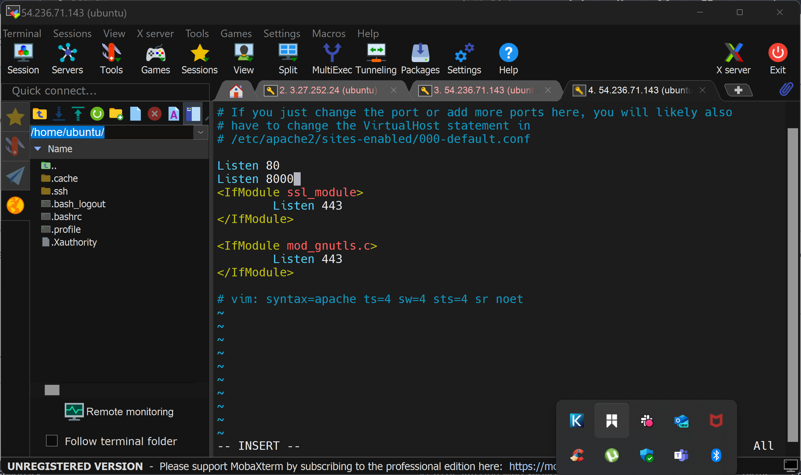

- Next we opened file with command `sudo vi /etc/apache2/sites-available/000-default.conf`, change virtual host port 80 to 8000. Then restarted apache.

Refer to image:

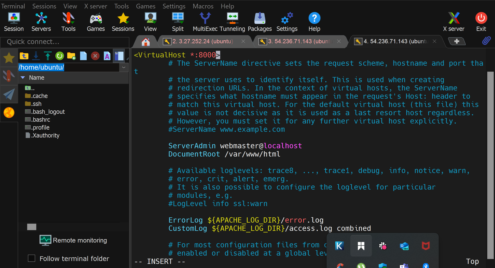

- Next we opened a new `index.html` file with command `sudo vi index.html`. Then pasted a placeholder text for IP address in html file.

Refer to image:

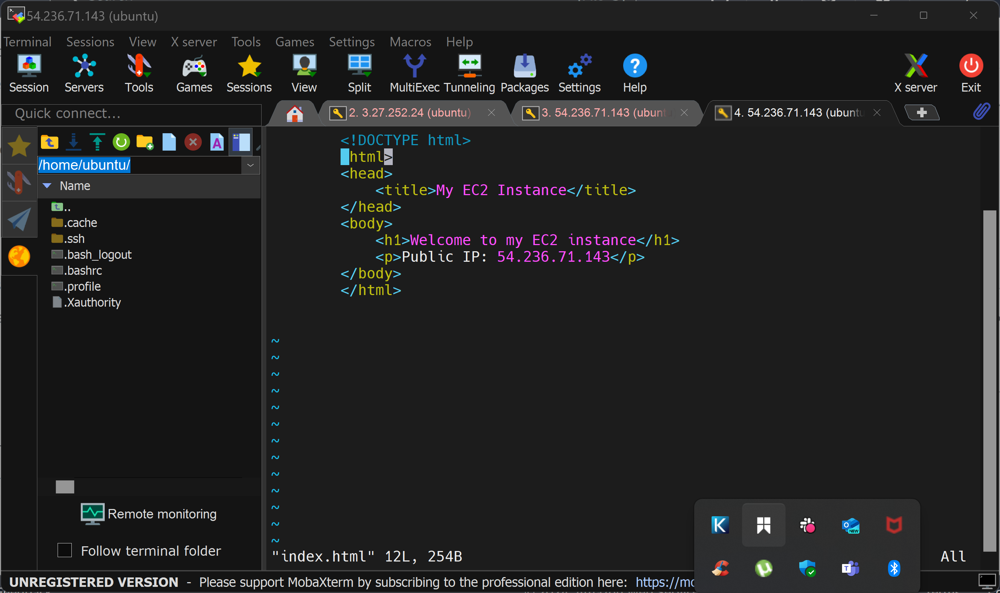

- Overriding the default html file of Apache Webserver, we used command `sudo cp -f ./index.html /var/www/html/index.html` to replace it, then restarted webserver.

Refer to image:

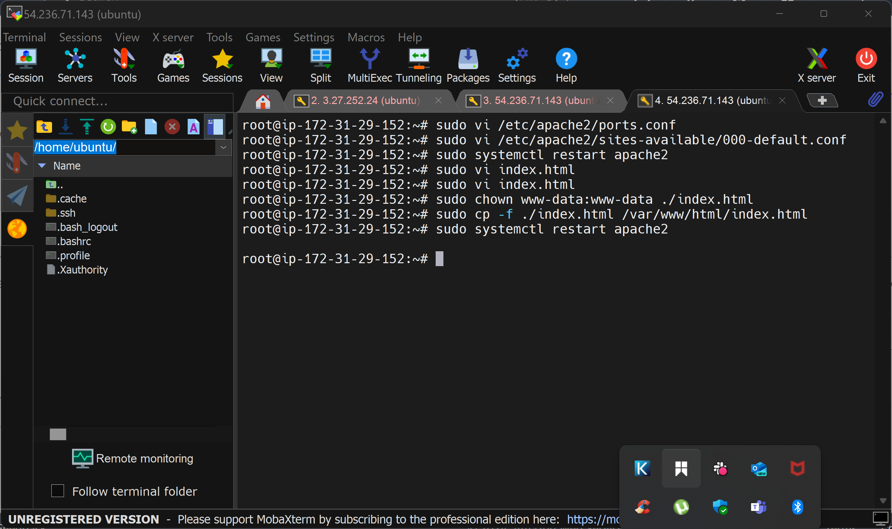

### RESULT:

### Step 4 - Cofiguring Nginx as a Load Balancer

- Lunched a new EC2 instance to run on port 80.

Refer to image:

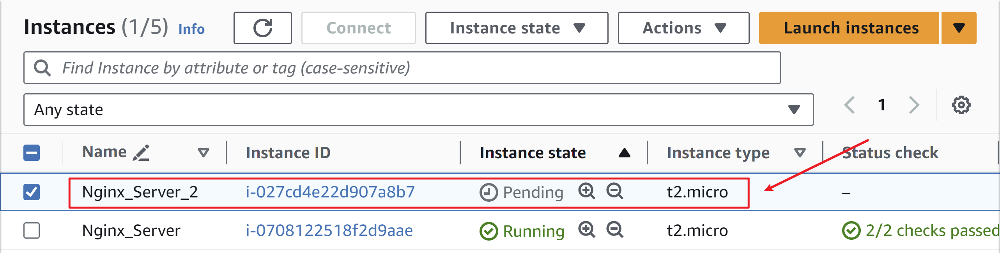

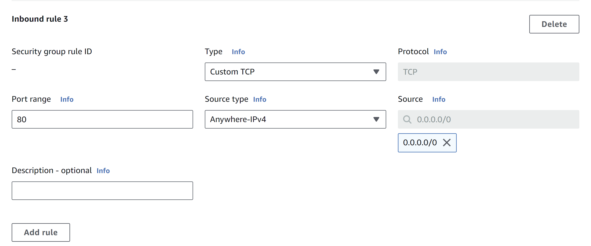

- Connect to webserver, install nginx, then verify status to check if running.

Refer to image:

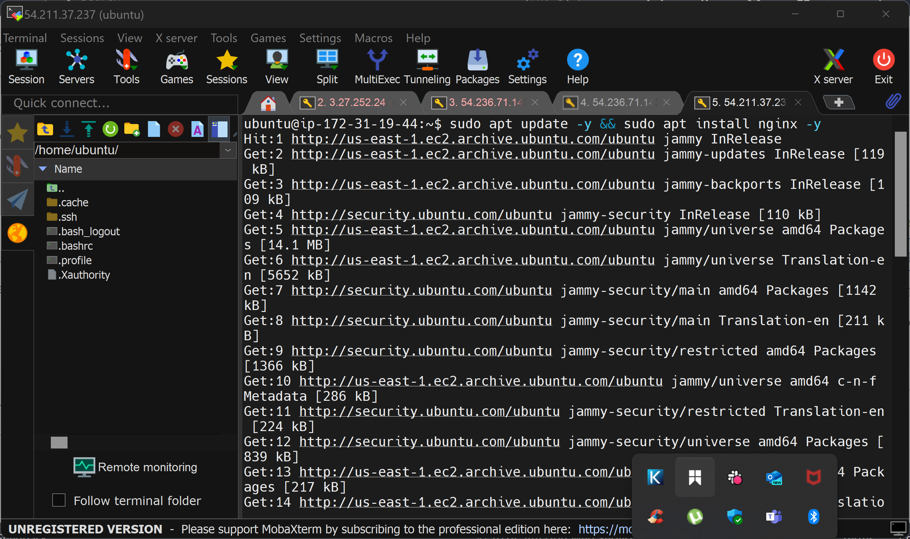

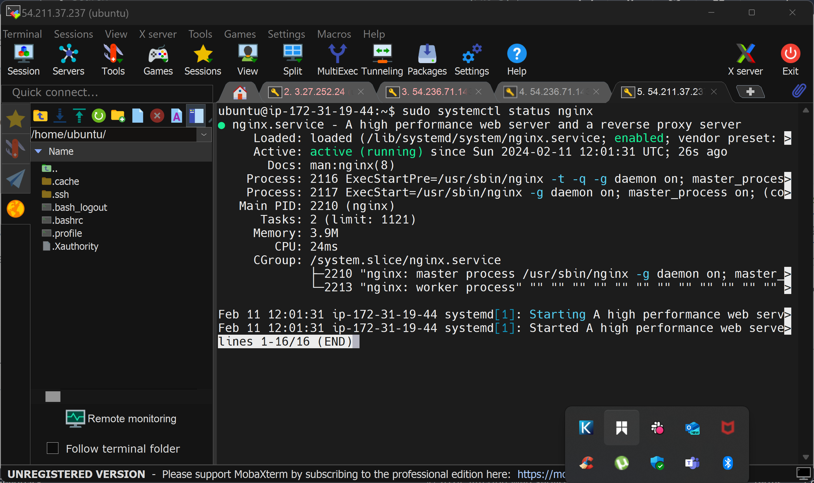

- Opened Nginx configuration file with command `sudo vi /etc/nginx/conf.d/loadbalancer.conf`, then pasted configuration file edit and saved.

Refer to image:

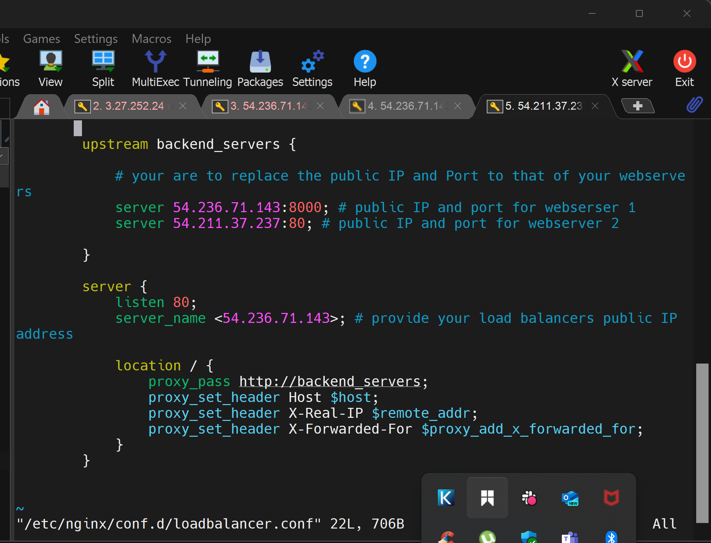

- Test configuration with `sudo nginx -t` 

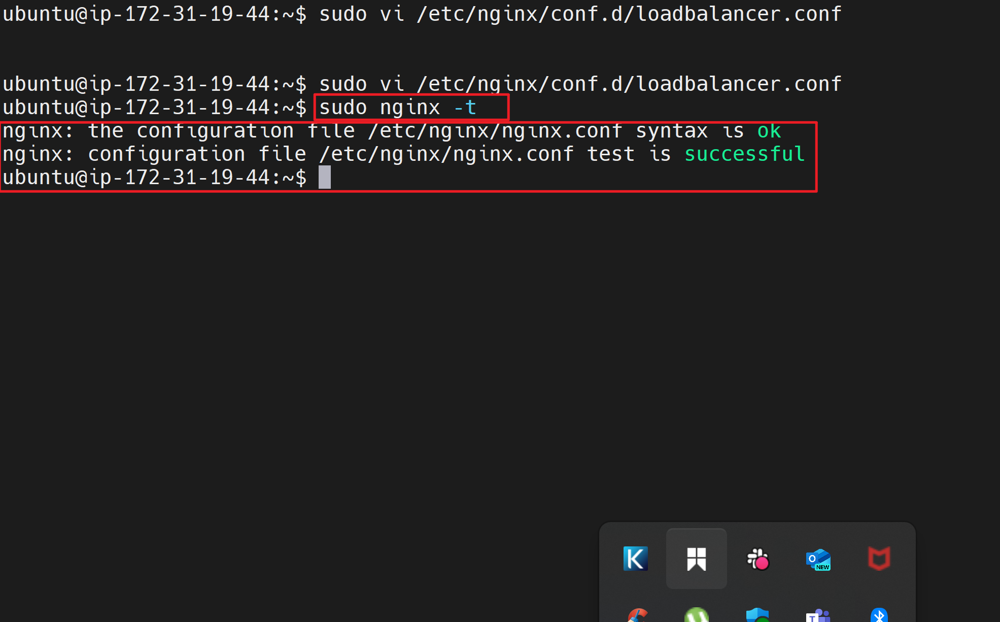

### RESULT:

